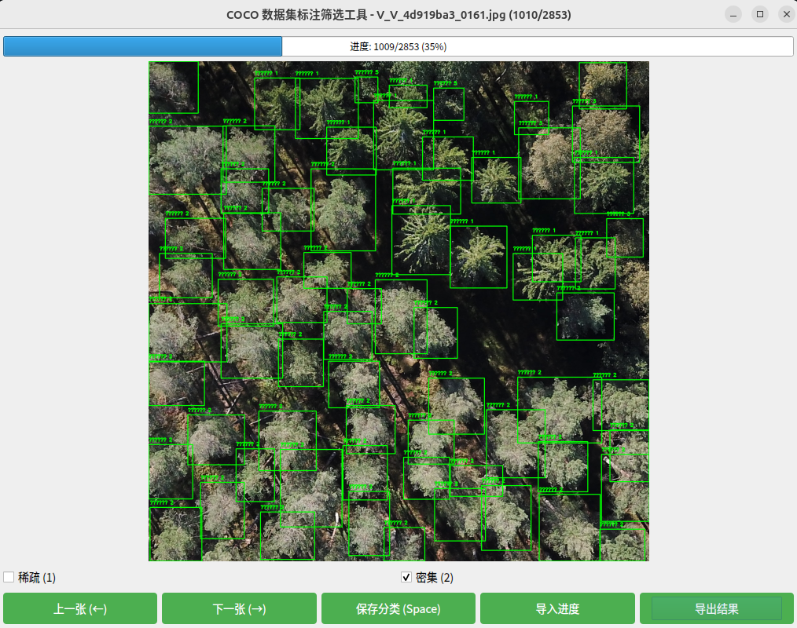

# COCO 数据集标注筛选工具使用说明

## 简介

该工具用于对 COCO 数据集进行标注筛选，支持快速分类和进度管理。

## 功能

- **图像浏览**：使用左右方向键或按钮切换图片。
- **快速分类**：使用数字键 `1` 和 `2` 快速标记为“稀疏”或“密集”。
- **保存进度**：使用空格键或“保存分类”按钮保存当前分类并前进。
- **导入/导出进度**：支持从文本文件导入和导出分类进度。

## 界面说明

- **进度条**：显示当前标注进度。
- **图像显示区域**：展示当前图像及其标注。
- **分类选择**：通过复选框或快捷键选择分类。
- **控制按钮**：用于切换图片、保存分类、导入和导出结果。

## 快捷键

- `←`：上一张图片
- `→`：下一张图片
- `1`：标记为“稀疏”
- `2`：标记为“密集”
- `Space`：保存当前分类并前进

## 使用步骤

1. 启动程序并加载数据集。
2. 使用方向键或按钮浏览图片。
3. 使用快捷键或复选框进行分类。
4. 定期保存进度，必要时导出结果。
5. 需要时可通过“导入进度”按钮恢复之前的工作。

## 注意事项

- 确保图像和标注文件路径正确。
- 导入和导出文件时，请选择正确的文本文件格式。
